## MySQL - JDBC Connection

To test the connections we need to have MySQL database in place. There are many ways to do it but simplest of all is using Docker.
This tutorial uses latest My SQL Docker image and PHP My Admin to test the java-mq sql connection.

---
### Steps:

---

### Data Base connection Logical Diagram: 
> 

### Local Database Env Set Up to Test

* First you need to install Docker-Desktop. To install Docker follow below link:
 [Docker-Desktop](https://www.docker.com/products/docker-desktop)
 
* Once docker is installed, go to Docker-Desktop settings and increase the memory to at least 2 GB (more the better, if you have 8 GB RAM, then give 4 GB).

> 

> 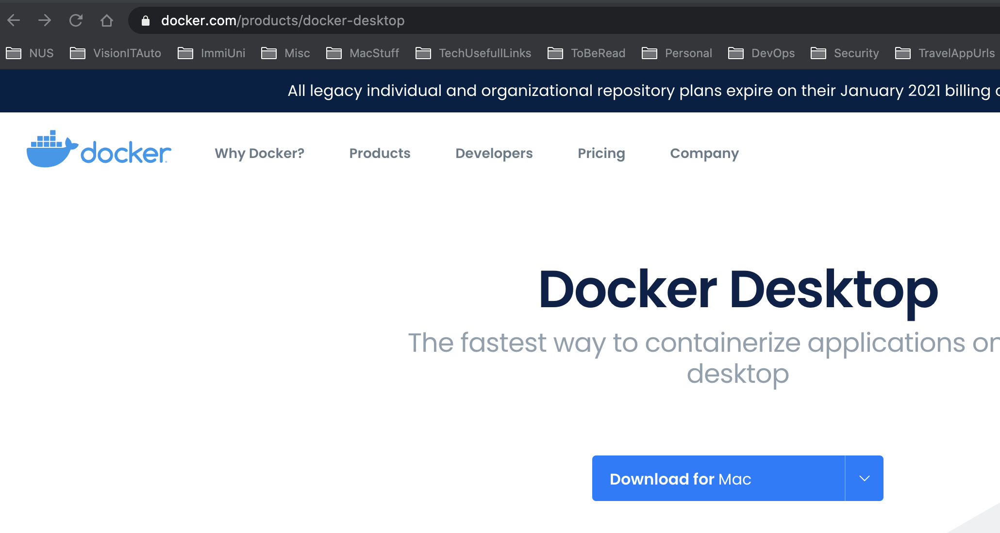

> 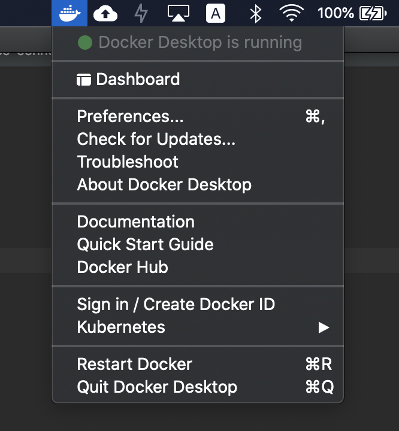

> 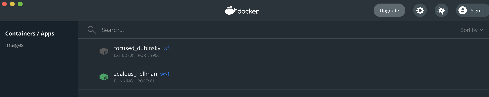

> 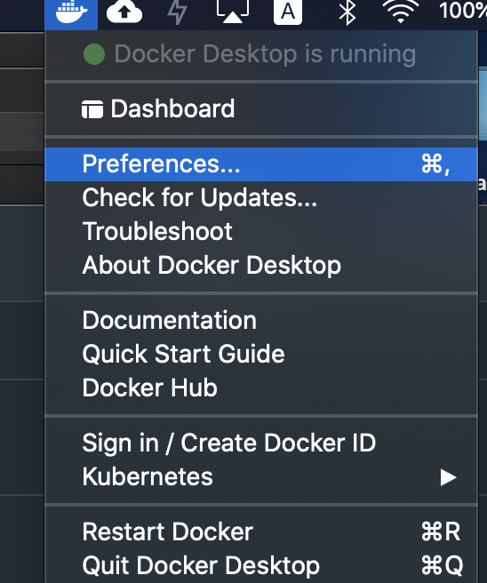

> 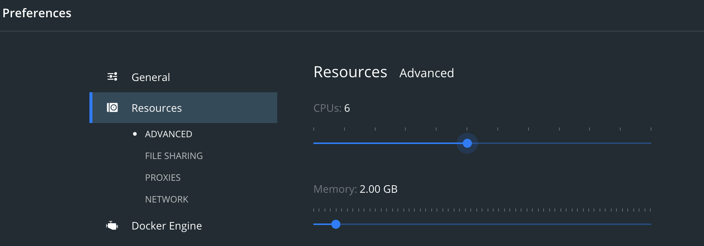

> 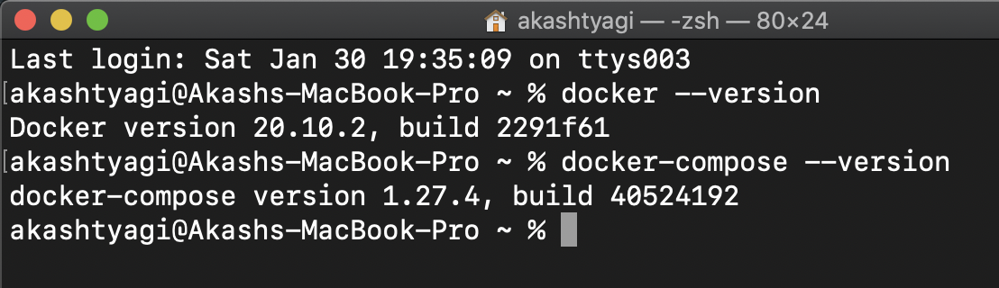

> 

> 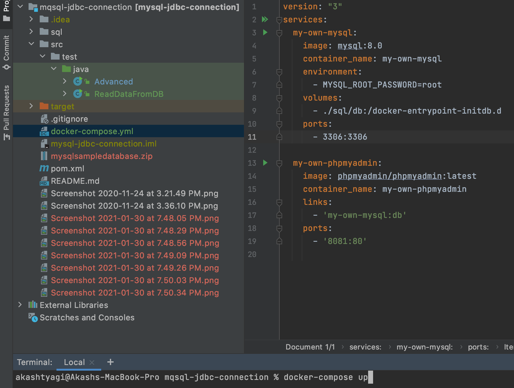

> 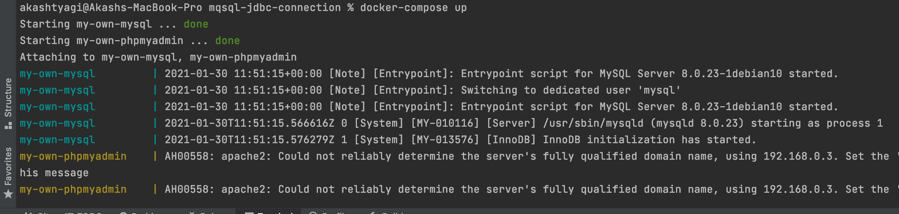

> 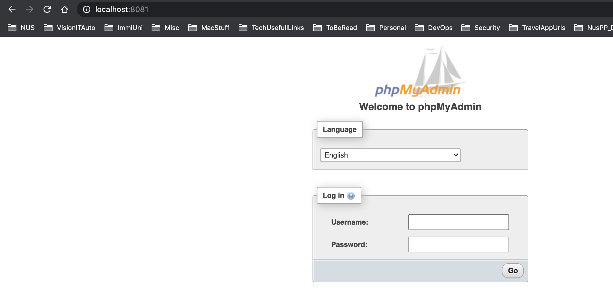

> 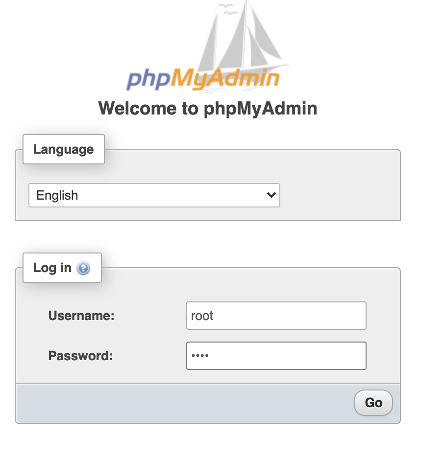

> 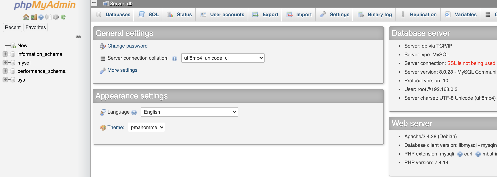

> 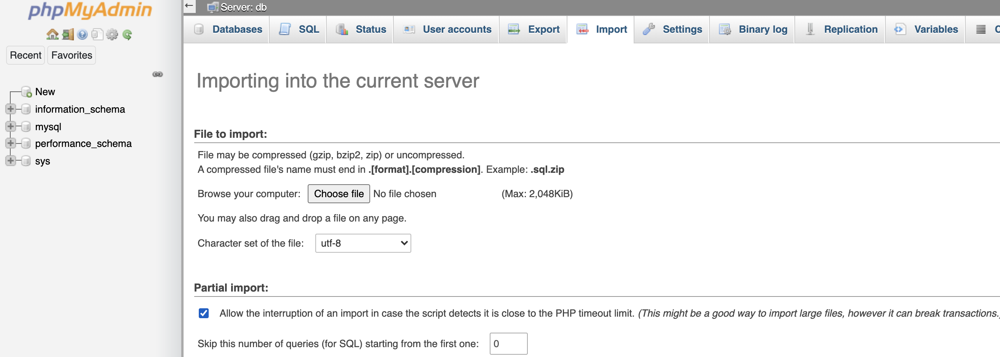

> 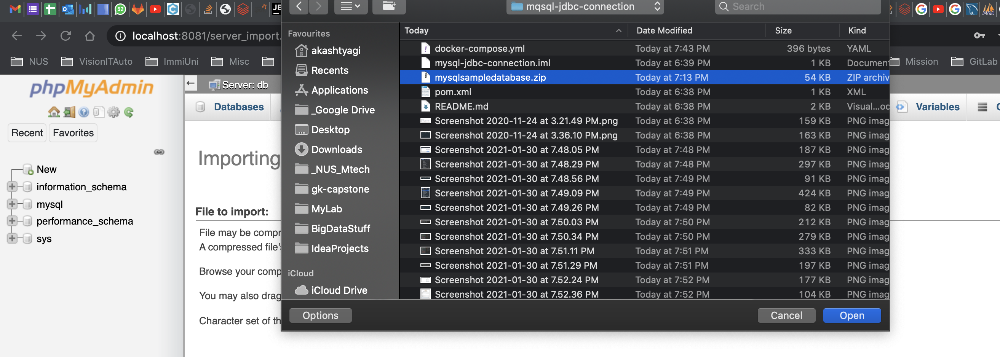

> 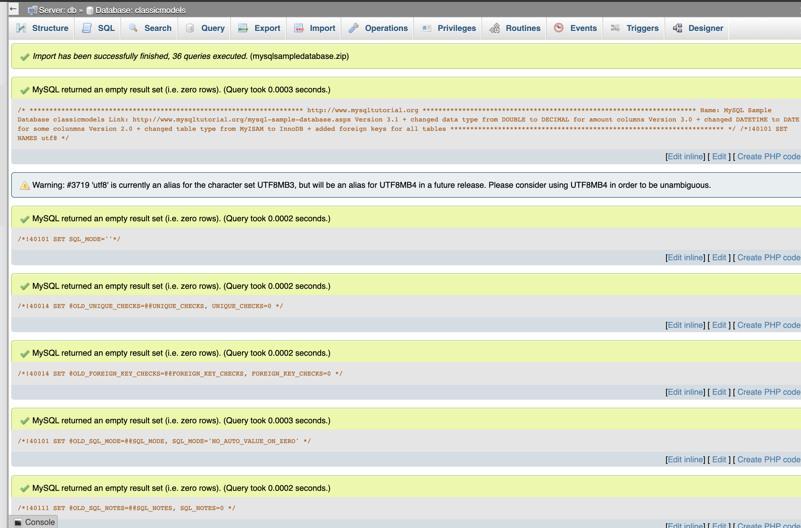

> 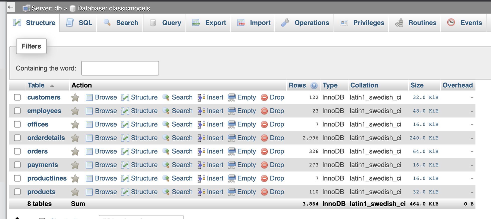

> 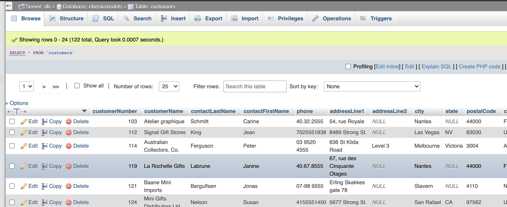

> 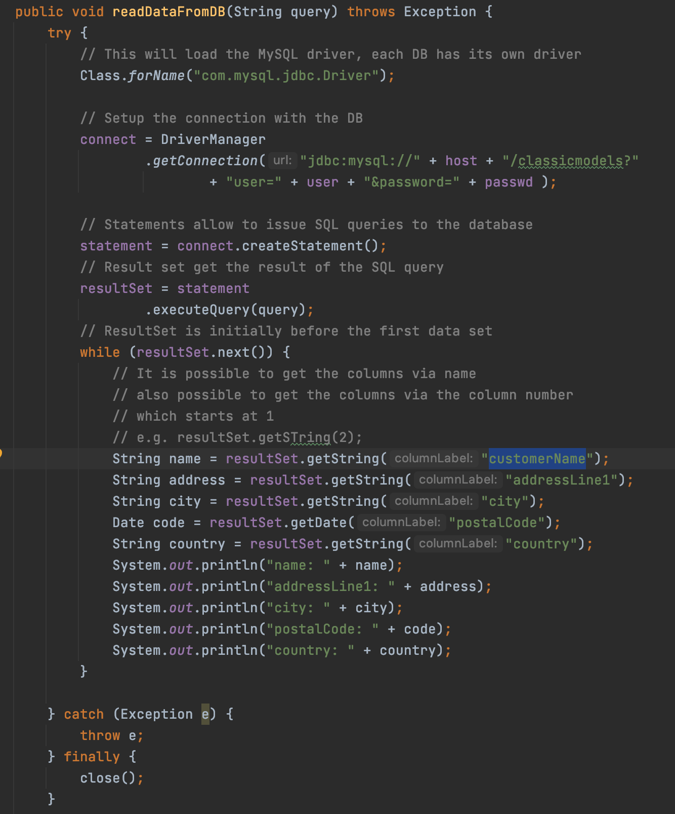

> 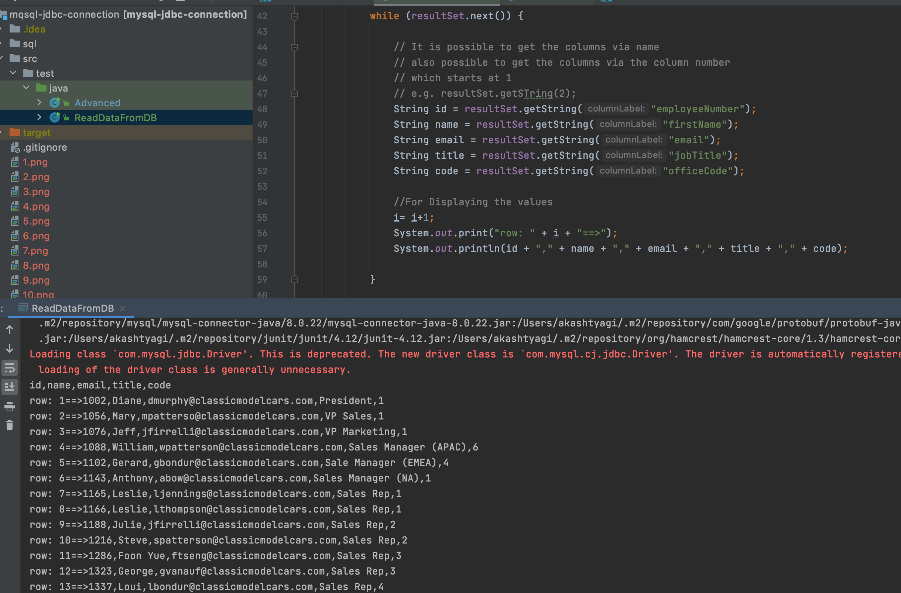

> 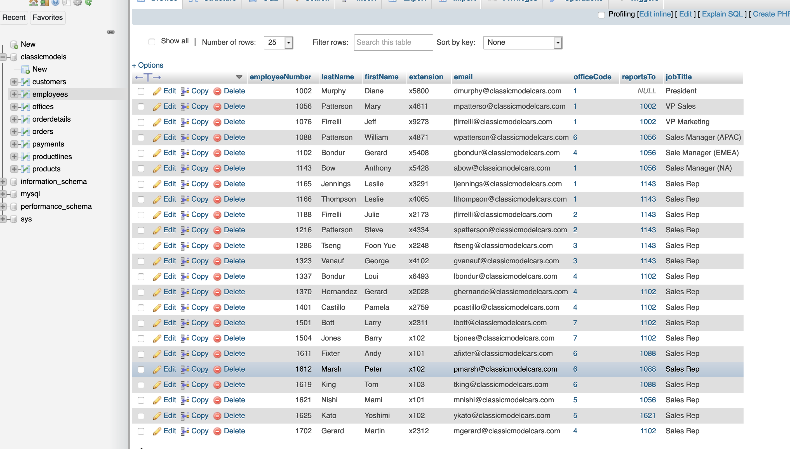

